# Database CareerMate

## Arsitektur

CareerMate memakai PostgreSQL portabel yang di-host di Supabase. Browser hanya berkomunikasi dengan Fastify; kredensial database dan query tetap berada di backend. Drizzle ORM menyediakan query terparameterisasi dan Drizzle Kit menghasilkan migrasi SQL yang dapat direproduksi.

Data dipisahkan menjadi dua schema:

- `app`: data milik pengguna, CV, motivation letter, dan interview.
- `career`: taksonomi karier, sumber eksternal, occupation, skill, dan lowongan.

Tidak ada kolom embedding saat ini. Setelah model embedding dan dimensinya diputuskan, `pgvector` dapat ditambahkan lewat migrasi terpisah untuk deskripsi occupation/job serta materi belajar. Database mentah tidak boleh diberikan langsung kepada LLM; gunakan fungsi context pada repository.

## ERD

```mermaid
erDiagram
  USERS ||--o| PROFILES : has
  USERS ||--o{ USER_SKILLS : owns
  USERS ||--o{ USER_INTERESTS : owns
  USERS ||--o{ EDUCATION : owns
  USERS ||--o{ EXPERIENCES : owns
  USERS ||--o{ PROJECTS : owns
  USERS ||--o{ CERTIFICATIONS : owns
  USERS ||--o{ RESUMES : owns
  USERS ||--o{ MOTIVATION_LETTERS : owns
  USERS ||--o{ INTERVIEW_SESSIONS : owns
  USERS ||--o{ SAVED_JOBS : saves

  SKILLS ||--o{ USER_SKILLS : classifies
  INTERESTS ||--o{ USER_INTERESTS : classifies
  PROJECTS ||--o{ PROJECT_SKILLS : demonstrates
  SKILLS ||--o{ PROJECT_SKILLS : used_in

  DATA_SOURCES ||--o{ DATA_IMPORT_RUNS : tracks
  DATA_SOURCES ||--o{ EXTERNAL_MAPPINGS : defines
  OCCUPATIONS ||--o{ OCCUPATION_SKILLS : requires
  SKILLS ||--o{ OCCUPATION_SKILLS : relates
  OCCUPATIONS ||--o{ OCCUPATION_INTERESTS : aligns
  INTERESTS ||--o{ OCCUPATION_INTERESTS : relates
  OCCUPATIONS ||--o{ OCCUPATION_KNOWLEDGE : needs
  KNOWLEDGE_AREAS ||--o{ OCCUPATION_KNOWLEDGE : relates
  OCCUPATIONS ||--o{ OCCUPATION_ABILITIES : needs
  ABILITIES ||--o{ OCCUPATION_ABILITIES : relates
  OCCUPATIONS ||--o{ OCCUPATION_TECHNOLOGIES : uses
  TECHNOLOGIES ||--o{ OCCUPATION_TECHNOLOGIES : relates
  OCCUPATIONS ||--o{ JOBS : categorizes
  JOBS ||--o{ JOB_SKILLS : requires
  SKILLS ||--o{ JOB_SKILLS : relates

  RESUMES ||--o{ RESUME_EDUCATION : selects
  RESUMES ||--o{ RESUME_EXPERIENCES : selects
  RESUMES ||--o{ RESUME_PROJECTS : selects
  RESUMES ||--o{ RESUME_SKILLS : selects
  INTERVIEW_SESSIONS ||--o{ INTERVIEW_QUESTIONS : contains
  INTERVIEW_QUESTIONS ||--o| INTERVIEW_ANSWERS : receives
```



## Tabel

Schema `career`:

- `data_sources`, `data_import_runs`: provenance, lisensi, versi, dan audit import.
- `skills`, `skill_aliases`: canonical skill dan label alternatif.
- `occupations`: canonical occupation; `external_id` mempertahankan kode sumber.
- `interests`, `knowledge_areas`, `abilities`, `technologies`: dimensi referensi.
- `occupation_skills`, `occupation_interests`, `occupation_knowledge`, `occupation_abilities`, `occupation_technologies`: relasi bernilai dan sumbernya.
- `external_mappings`: pemetaan O*NET/ESCO/KBJI dengan status review dan confidence.
- `jobs`, `job_skills`: lowongan dan persyaratan skill; synthetic record wajib ditandai.

Schema `app`:

- `users`: referensi identitas auth (`auth_provider`, `auth_subject`), bukan password.
- `profiles`, `career_preferences`, `user_target_occupations`.
- `user_skills`, `user_interests`, `education`, `experiences`, `projects`, `project_skills`, `certifications`.
- `saved_jobs`.
- `resumes` dan empat tabel pilihan resume memungkinkan banyak versi CV tanpa menggandakan data profil.
- `motivation_letters` menyimpan versi yang dikendalikan pengguna.
- `interview_sessions`, `interview_questions`, `interview_answers` menyiapkan alur latihan tanpa menghasilkan feedback AI saat ini.

Total: **38 tabel**.

## Constraint dan indeks

- Unique identity: `(auth_provider, auth_subject)` dan email pengguna.
- Canonical skill: `normalized_name` unik; alias unik per locale.
- Sumber: `(name, version)` unik dan external identifier unik per sumber.
- Relasi user/skill, occupation/skill, job/skill, dan mapping memiliki composite unique/primary key.
- Check constraint membatasi skor 0–100, confidence 0–1, interest 1–5, job zone 1–5, dan pengalaman non-negatif.
- Indeks tersedia pada judul/nama pencarian serta foreign key bertrafik tinggi (`user_id`, `occupation_id`, `skill_id`, `job_id`).
- Detail occupation diambil dengan query relasi paralel; daftar project memuat relasi secara batch. Matching berjalan sebagai SQL CTE agregat, bukan loop seluruh occupation di memori.

Pencarian awal memakai exact/`ILIKE` partial matching. Vector search dan Elasticsearch sengaja belum ditambahkan.

## Migrasi

Migrasi awal berada di `backend/drizzle/0000_initial_database.sql`, dengan snapshot di `backend/drizzle/meta/`.

```powershell
npm run db:check --workspace @careermate/backend
npm run db:migrate --workspace @careermate/backend
```

Setelah mengubah `src/db/schema.ts`:

```powershell
npm run db:generate --workspace @careermate/backend
npm run db:check --workspace @careermate/backend
```

Review SQL hasil generate sebelum commit. Jangan mengubah database production lewat Dashboard tanpa migrasi yang ekuivalen.

`drizzle-kit` dan `drizzle-orm` juga tercantum sebagai root development tooling. Ini disengaja agar CLI Drizzle dapat menemukan peer package yang di-hoist oleh npm workspaces; versi backend dan root harus selalu diselaraskan.

## Seed

`backend/data/seed/career-reference.seed.json` adalah subset terkurasi dan dimodifikasi dari O*NET 31.0. Isinya 30 occupation, 168 skill, 2.371 occupation-skill relation, 9 interest, 28 knowledge area, 17 ability, 140 technology, 30 job sintetis, dan 5 profil fiktif. Seed bersifat idempoten.

```powershell
npm run db:seed --workspace @careermate/backend
```

Untuk meregenerasi seed setelah mengambil O*NET yang sama:

```powershell
npm run data:build-seed --workspace @careermate/backend
```

## Reset dan backup

Untuk development database yang memang boleh dihapus, reset schema menggunakan SQL editor/`psql`, lalu jalankan migrasi dan seed lagi:

```sql
DROP SCHEMA IF EXISTS app CASCADE;
DROP SCHEMA IF EXISTS career CASCADE;
DROP SCHEMA IF EXISTS drizzle CASCADE;
```

Perintah tersebut destruktif dan tidak boleh dijalankan pada production. Buat backup terverifikasi sebelum migrasi production, misalnya `pg_dump --format=custom`, simpan terenkripsi, lalu uji restore dengan `pg_restore` ke project terpisah. Ikuti pula kebijakan backup/PITR paket Supabase yang dipakai.

## Keamanan dan Supabase

- Backend memverifikasi JWT melalui JWKS Supabase di production; kunci signing tidak disalin ke frontend.
- Development auth memakai header fixture dan dilarang oleh validasi environment ketika `NODE_ENV=production`.
- Semua query data pribadi memasukkan `user_id` hasil autentikasi; ID pengguna dari body tidak dipercaya.
- Schema `app` dan `career` tidak perlu dimasukkan ke exposed schemas Supabase/PostgREST.
- Aplikasi tidak memakai Supabase browser client atau service-role key.
- Buat role PostgreSQL backend dengan hak minimum bila deployment telah stabil. Jika schema kelak diekspos melalui Supabase Data API, aktifkan dan uji RLS terlebih dahulu; backend authorization tetap tidak boleh dihapus.

Environment backend yang terkait database/auth:

| Variable | Wajib | Keterangan |
| --- | --- | --- |
| `DATABASE_MODE` | ya | `embedded` untuk development otomatis atau `postgres` untuk production/Supabase |
| `DATABASE_URL` | production | PostgreSQL direct/session-pooler URL Supabase |
| `DATABASE_SSL_MODE` | ya | `require` (default), `verify-full`, atau `disable` hanya untuk DB lokal |
| `DATABASE_POOL_MAX` | ya | maksimum koneksi pool, default 10 |
| `AUTH_MODE` | ya | `development` atau `jwks`; development ditolak di production |
| `AUTH_DEV_USER_ID`, `AUTH_DEV_EMAIL` | development | fixture identity lokal |
| `AUTH_JWKS_URL` | mode JWKS | endpoint JWKS Supabase |
| `AUTH_JWT_ISSUER` | mode JWKS | issuer project Supabase |
| `AUTH_JWT_AUDIENCE` | mode JWKS | default `authenticated` |
| `CORS_ORIGINS` | ya | daftar origin frontend, dipisahkan koma |

## Context untuk AI masa depan

`CareerRepository` menyediakan `getUserCareerContext`, `getOccupationContext`, `getJobMatchContext`, dan `getUserCvContext`. Fungsi ini mengembalikan data terstruktur yang sudah dibatasi kepemilikan. LLM mandiri belum dibuat dan kelak tidak boleh diberi akses SQL langsung.
